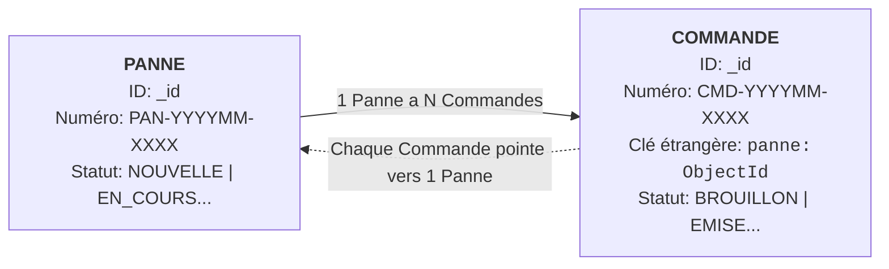
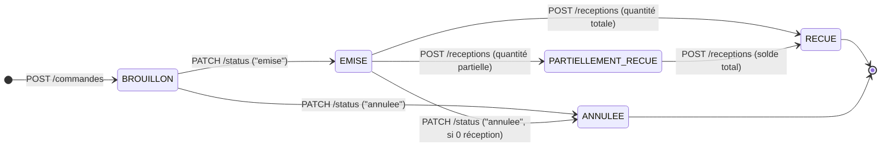

# 📋 Spécification Technique Backend — Modules Panne & Commande

> **Document de Référence & Contrat d'API**  
> **Version :** 1.1.0  
> **Statut :** Validé & Stable  
> **Public cible :** Équipe Frontend / Intégration API

---

## 📑 Sommaire

1. [Architecture Globale & Relation Panne ↔ Commande](#1-architecture-globale--relation-panne--commande)
2. [Règles Métier Clés & Comportements Automatiques](#2-règles-métier-clés--comportements-automatiques)
3. [Module Panne — Référentiel Exhaustif des Endpoints](#3-module-panne--référentiel-exhaustif-des-endpoints)
   - [`GET /api/v1/pannes/options`](#31-get-apiv1pannesoptions--options-dynamiques-ui)
   - [`GET /api/v1/pannes`](#32-get-apiv1pannes--lister-les-pannes-avec-filtres--pagination)
   - [`GET /api/v1/pannes/:id`](#33-get-apiv1pannesid--fiche-détaillée--commandes-associées)
   - [`POST /api/v1/pannes`](#34-post-apiv1pannes--déclarer-une-nouvelle-panne)
   - [`PATCH /api/v1/pannes/:id`](#35-patch-apiv1pannesid--modifier-une-panne)
   - [`PATCH /api/v1/pannes/:id/statut`](#36-patch-apiv1pannesidstatut--changer-le-statut-dune-panne)
   - [`DELETE /api/v1/pannes/:id`](#37-delete-apiv1pannesid--supprimer-une-panne-soft-delete)
4. [Module Commande — Référentiel Exhaustif des Endpoints](#4-module-commande--référentiel-exhaustif-des-endpoints)
   - [`GET /api/v1/commandes`](#41-get-apiv1commandes--lister-les-commandes-avec-filtres--pagination)
   - [`GET /api/v1/commandes/:id`](#42-get-apiv1commandesid--fiche-détaillée-dune-commande)
   - [`POST /api/v1/commandes`](#43-post-apiv1commandes--créer-une-nouvelle-commande)
   - [`PATCH /api/v1/commandes/:id`](#44-patch-apiv1commandesid--mettre-à-jour-les-articles--devis)
   - [`PATCH /api/v1/commandes/:id/status`](#45-patch-apiv1commandesidstatus--émettre-ou-annuler-une-commande)
   - [`POST /api/v1/commandes/:id/receptions`](#46-post-apiv1commandesidreceptions--enregistrer-une-livraison--réception)
   - [`DELETE /api/v1/commandes/:id`](#47-delete-apiv1commandesid--supprimer-une-commande-soft-delete)
5. [Matrice des Codes d'Erreur & Réponses Standard](#5-matrice-des-codes-derreur--réponses-standard)

---

## 1. Architecture Globale & Relation Panne ↔ Commande



### Principes Directeurs
* **Clé étrangère unique :** Le schéma `Commande` contient le champ `panne` (`ObjectId`, obligatoire).
* **Peuplement automatique :** Lors de l'appel à `GET /api/v1/pannes/:id`, le backend exécute automatiquement une agrégation pour injecter le tableau `commandes[]` avec les informations essentielles de chaque commande liée.

---

## 2. Règles Métier Clés & Comportements Automatiques

### 2.1 Articles Catalogue vs Hors-Catalogue
Le backend autorise deux formats d'articles dans une commande :

| Type d'article | Identification | Comportement Backend |
| :--- | :--- | :--- |
| **Catalogue** | `equipement` (ObjectId) | L'équipement existe déjà dans le catalogue. Le backend vérifie sa présence. |
| **Hors-Catalogue** | `typeEquipement` (ObjectId) + `designation` (String) | L'équipement n'est pas encore au catalogue. Il sera **auto-créé** lors de la réception physique. |

---

### 2.2 Règle d'Affectation du `prixUnitaire` à la Création
* **Comportement par défaut (`utiliserPrixCatalogue: false` ou omis) :**  
  Le `prixUnitaire` est initialisé à `0` (sauf si une valeur explicite est transmise dans l'article).
* **Option Catalogue activée (`utiliserPrixCatalogue: true`) :**  
  Pour les articles catalogue dont le prix n'est pas précisé (`=== 0`), le backend injecte automatiquement le dernier prix catalogue connu (`catalogItem.prix`), à condition que `prix > 0`.
* **Articles Hors-Catalogue :**  
  Le prix reste toujours à `0` à la création (le coût réel sera saisi à la réception).
* **Règle de priorité :**  
  Toute valeur de `prixUnitaire` explicitement fournie par l'appelant est **toujours prioritaire**.

---

### 2.3 Cycle de Vie des Statuts de Commande



---

### 2.4 Automatismes lors de la Réception (`POST /receptions`)
Dès qu'une réception physique est enregistrée :
1. **Mise à jour des quantités reçues :** `quantiteRecue` est incrémenté sur chaque ligne d'article.
2. **Transition de statut automatique :** Si tous les articles ont atteint leur quantité commandée, le statut passe automatiquement à `RECUE` ; sinon, il passe à `PARTIELLEMENT_RECUE`.
3. **Auto-création d'Équipement :** Pour tout article hors-catalogue, une nouvelle fiche équipement est créée automatiquement dans le catalogue avec la désignation et le prix unitaire d'achat constaté.
4. **Historisation du prix :** Le prix de l'équipement catalogue est mis à jour et consigné dans `historique_prix`.
5. **Verrouillage d'immuabilité :** Dès la première réception, les prix unitaires reçus sont figés. L'annulation ou la suppression de la commande devient **strictement interdite** (`409 Conflict`).

---

## 3. Module Panne — Référentiel Exhaustif des Endpoints

### 3.1 `GET /api/v1/pannes/options` — Options Dynamiques UI
Permet de récupérer les listes d'énumérations pour alimenter dynamiquement les menus déroulants et filtres de l'interface.

* **Authentification :** Requise (`Bearer Token`)
* **Méthode :** `GET`
* **Réponse HTTP :** `200 OK`

```json
{
  "success": true,
  "data": {
    "types_panne": ["Équipement", "Espace/Système"],
    "niveaux_urgence": ["Faible", "Moyen", "Élevé", "Critique"],
    "statuts": [
      "NOUVELLE",
      "PRISE_EN_CHARGE",
      "EN_DIAGNOSTIC",
      "EN_ATTENTE_PIECE",
      "RESOLUE",
      "CLOTUREE",
      "REJETEE"
    ],
    "impacts_services": [
      "Aucun",
      "Léger ralentissement",
      "Un service complet",
      "Plusieurs services",
      "Serveur dysfonctionnel"
    ],
    "types_espace": ["Salle", "Bureau", "Laboratoire", "Couloir", "Autre"]
  }
}
```

---

### 3.2 `GET /api/v1/pannes` — Lister les Pannes avec Filtres & Pagination
Retourne la liste paginée des tickets de panne selon les critères de recherche.

* **Authentification :** Requise (`Bearer Token`)
* **Méthode :** `GET`
* **Paramètres d'URL (Query Params) :**
  - `page` *(integer, défaut: 1)* — Numéro de page.
  - `limit` *(integer, défaut: 20)* — Nombre d'éléments par page.
  - `search` *(string)* — Recherche textuelle sur le numéro, la description ou la désignation.
  - `statut` *(string)* — Filtre par statut (`NOUVELLE`, `EN_COURS`, etc.).
  - `niveau_urgence` *(string)* — Filtre par urgence (`Faible`, `Moyen`, `Élevé`, `Critique`).
  - `type_panne` *(string)* — `Équipement` ou `Espace/Système`.
  - `date_debut` / `date_fin` *(string ISO)* — Intervalle de dates.

* **Réponse HTTP :** `200 OK`
```json
{
  "success": true,
  "data": [
    {
      "_id": "66c011111111111111111111",
      "numero": "PAN-202608-0001",
      "description": "L'écran principal scintille et s'éteint",
      "type_panne": "Équipement",
      "statut": "NOUVELLE",
      "niveau_urgence": "Moyen",
      "declarant": {
        "_id": "66a010000000000000000001",
        "nom": "Dupont",
        "prenom": "Jean",
        "email": "jean.dupont@kouma.com"
      },
      "createdAt": "2026-08-16T14:00:00.000Z"
    }
  ],
  "pagination": {
    "total": 45,
    "page": 1,
    "limit": 20,
    "totalPages": 3
  }
}
```

---

### 3.3 `GET /api/v1/pannes/:id` — Fiche Détaillée & Commandes Associées
Retourne la fiche complète d'une panne avec l'ensemble des commandes d'approvisionnement associées.

* **Authentification :** Requise (`Bearer Token`)
* **Méthode :** `GET`
* **Réponse HTTP :** `200 OK`
```json
{
  "success": true,
  "data": {
    "_id": "66c011111111111111111111",
    "numero": "PAN-202608-0001",
    "description": "L'écran principal de l'accueil clignote et s'éteint",
    "type_panne": "Équipement",
    "statut": "EN_ATTENTE_PIECE",
    "niveau_urgence": "Moyen",
    "equipement": {
      "designation": "Écran Dell 24 pouces",
      "qte": 1,
      "modele": "P2419H",
      "numero_serie": "SN-DELL-98213"
    },
    "impact_services": ["Un service complet"],
    "tentatives_realisees": ["Reconnexion câbles", "Test autre prise"],
    "besoin_intervention": true,
    "declarant": {
      "_id": "66a010000000000000000001",
      "nom": "Dupont",
      "prenom": "Jean"
    },
    "commandes": [
      {
        "_id": "66c055555555555555555555",
        "numero": "CMD-202608-0001",
        "status": "EMISE",
        "prixtotal": 85000,
        "createdAt": "2026-08-16T16:15:00.000Z"
      }
    ]
  }
}
```

---

### 3.4 `POST /api/v1/pannes` — Déclarer une Nouvelle Panne
Enregistre une nouvelle déclaration de panne dans le système.

* **Authentification :** Requise (Rôle `Admin`)
* **Méthode :** `POST`
* **Corps de la requête (Body JSON) :**
```json
{
  "description": "L'écran principal de l'accueil clignote et s'éteint",
  "type_panne": "Équipement",
  "equipement": {
    "designation": "Écran Dell 24 pouces",
    "qte": 1,
    "modele": "P2419H",
    "numero_serie": "SN-DELL-98213"
  },
  "niveau_urgence": "Moyen",
  "impact_services": ["Un service complet"],
  "tentatives_realisees": ["Reconnexion câbles"],
  "besoin_intervention": true
}
```
* **Réponse HTTP :** `201 Created`
```json
{
  "success": true,
  "message": "Panne créée avec succès",
  "data": {
    "_id": "66c011111111111111111111",
    "numero": "PAN-202608-0001",
    "statut": "NOUVELLE"
  }
}
```

---

### 3.5 `PATCH /api/v1/pannes/:id` — Modifier une Panne
Met à jour les informations descriptives d'une panne.

* **Authentification :** Requise (Rôle `Admin`)
* **Méthode :** `PATCH`
* **Corps de la requête :** Champs à modifier (`description`, `niveau_urgence`, `photos`, etc.).
* **Réponse HTTP :** `200 OK`

---

### 3.6 `PATCH /api/v1/pannes/:id/statut` — Changer le Statut d'une Panne
Permet de faire évoluer le statut d'un ticket d'incident en consignant un commentaire d'audit.

* **Authentification :** Requise (Rôle `Admin`)
* **Méthode :** `PATCH`
* **Corps de la requête :**
```json
{
  "statut": "EN_DIAGNOSTIC",
  "commentaire": "Prise en charge par l'équipe maintenance"
}
```
* **Réponse HTTP :** `200 OK`

---

### 3.7 `DELETE /api/v1/pannes/:id` — Supprimer une Panne (Soft Delete)
Marque la panne comme supprimée sans perte d'historique (`isDeleted: true`).

* **Authentification :** Requise (Rôle `Admin`)
* **Méthode :** `DELETE`
* **Réponse HTTP :** `200 OK`
```json
{
  "success": true,
  "message": "Panne supprimée avec succès"
}
```

---

## 4. Module Commande — Référentiel Exhaustif des Endpoints

### 4.1 `GET /api/v1/commandes` — Lister les Commandes avec Filtres & Pagination
* **Authentification :** Requise (`Bearer Token`)
* **Méthode :** `GET`
* **Query Parameters :**
  - `page` *(integer, défaut: 1)*
  - `limit` *(integer, défaut: 20)*
  - `search` *(string)* — Recherche sur le numéro `CMD-...`, le fournisseur ou les articles.
  - `status` *(string)* — `brouillon`, `emise`, `partiellement_recue`, `recue`, `annulee`.
  - `fournisseur` *(string)* — ID MongoDB du fournisseur.

* **Réponse HTTP :** `200 OK`
```json
{
  "success": true,
  "data": [
    {
      "_id": "66c055555555555555555555",
      "numero": "CMD-202608-0001",
      "panne": {
        "_id": "66c011111111111111111111",
        "numero": "PAN-202608-0001"
      },
      "fournisseur": {
        "_id": "66c022222222222222222222",
        "nom": "Fournisseur Informatique SA"
      },
      "status": "BROUILLON",
      "prixtotal": 85000,
      "createdAt": "2026-08-16T16:15:00.000Z"
    }
  ],
  "pagination": { "total": 12, "page": 1, "limit": 20, "totalPages": 1 }
}
```

---

### 4.2 `GET /api/v1/commandes/:id` — Fiche Détaillée d'une Commande
* **Authentification :** Requise (`Bearer Token`)
* **Méthode :** `GET`
* **Réponse HTTP :** `200 OK`
```json
{
  "success": true,
  "data": {
    "_id": "66c055555555555555555555",
    "numero": "CMD-202608-0001",
    "panne": {
      "_id": "66c011111111111111111111",
      "numero": "PAN-202608-0001"
    },
    "fournisseur": {
      "_id": "66c022222222222222222222",
      "nom": "Fournisseur Informatique SA"
    },
    "demandeur": {
      "_id": "66a010000000000000000001",
      "nom": "Admin",
      "prenom": "Principal"
    },
    "status": "PARTIELLEMENT_RECUE",
    "prixtotal": 85000,
    "articles": [
      {
        "equipement": {
          "_id": "66c033333333333333333333",
          "designation": "Écran Dell 24 pouces"
        },
        "quantiteCommandee": 2,
        "quantiteRecue": 1,
        "prixUnitaire": 85000
      }
    ],
    "receptions": [
      {
        "_id": "66c099999999999999999999",
        "dateReception": "2026-08-16T17:00:00.000Z",
        "receptionnePar": { "nom": "Magasinier", "prenom": "Alain" },
        "articlesRecus": [
          {
            "equipement": "66c033333333333333333333",
            "quantiteRecue": 1,
            "prixUnitaire": 85000
          }
        ]
      }
    ]
  }
}
```

---

### 4.3 `POST /api/v1/commandes` — Créer une Nouvelle Commande
* **Authentification :** Requise (Rôle `Admin`)
* **Méthode :** `POST`
* **Corps de la requête :**
```json
{
  "panne": "66c011111111111111111111",
  "fournisseur": "66c022222222222222222222",
  "utiliserPrixCatalogue": true,
  "articles": [
    {
      "equipement": "66c033333333333333333333",
      "quantiteCommandee": 1
    },
    {
      "typeEquipement": "66c044444444444444444444",
      "designation": "Câble DisplayPort 2m Blindé",
      "quantiteCommandee": 2,
      "prixUnitaire": 0
    }
  ]
}
```
* **Champs clés :**
  - `panne` *(string, obligatoire)* : ID de la panne.
  - `fournisseur` *(string, obligatoire)* : ID du fournisseur.
  - `utiliserPrixCatalogue` *(boolean, optionnel, défaut `false`)* : si `true`, pré-remplit les prix catalogue > 0.
  - `articles` *(array, min 1)* : liste des lignes d'articles.
* **Réponse HTTP :** `201 Created`
```json
{
  "success": true,
  "message": "Commande créée avec succès",
  "data": {
    "_id": "66c055555555555555555555",
    "numero": "CMD-202608-0001",
    "status": "BROUILLON",
    "prixtotal": 85000
  }
}
```

---

### 4.4 `PATCH /api/v1/commandes/:id` — Mettre à jour les Articles / Devis
Permet de renseigner les prix négociés du devis ou d'ajuster les quantités avant livraison.

* **Authentification :** Requise (Rôle `Admin`)
* **Méthode :** `PATCH`
* **Corps de la requête :**
```json
{
  "articles": [
    {
      "equipement": "66c033333333333333333333",
      "quantiteCommandee": 1,
      "prixUnitaire": 82000
    }
  ]
}
```
* **Contrainte d'immuabilité :** Retourne `409 Conflict` si la commande est déjà `RECUE` ou `ANNULEE`, ou si le prix d'un article déjà réceptionné est modifié.

---

### 4.5 `PATCH /api/v1/commandes/:id/status` — Émettre ou Annuler une Commande
* **Authentification :** Requise (Rôle `Admin`)
* **Méthode :** `PATCH`
* **Corps de la requête :**
```json
{
  "status": "emise"
}
```
*(ou `{ "status": "annulee" }`)*
* **Contrainte d'intégrité :** L'annulation est rejetée (`409 Conflict`) dès lors qu'au moins une unité a été reçue (`quantiteRecue > 0`).

---

### 4.6 `POST /api/v1/commandes/:id/receptions` — Enregistrer une Livraison / Réception
Enregistre la réception physique des articles avec leurs prix d'achat réels figurant sur la facture fournisseur.

* **Authentification :** Requise (Rôle `Admin`)
* **Méthode :** `POST`
* **Corps de la requête :**
```json
{
  "articlesRecus": [
    {
      "equipement": "66c033333333333333333333",
      "quantiteRecue": 1,
      "prixUnitaire": 82000
    },
    {
      "typeEquipement": "66c044444444444444444444",
      "quantiteRecue": 2,
      "prixUnitaire": 6500
    }
  ]
}
```
* **Réponse HTTP :** `200 OK` (retourne la commande recalculée, avec statut `PARTIELLEMENT_RECUE` ou `RECUE`).

---

### 4.7 `DELETE /api/v1/commandes/:id` — Supprimer une Commande (Soft Delete)
* **Authentification :** Requise (Rôle `Admin`)
* **Méthode :** `DELETE`
* **Contrainte d'intégrité :** Rejeté (`409 Conflict`) si des réceptions existent.
* **Réponse HTTP :** `200 OK`

---

## 5. Matrice des Codes d'Erreur & Réponses Standard

Toutes les erreurs de l'API suivent la structure normalisée suivante :

```json
{
  "success": false,
  "message": "Description précise et explicite du motif d'erreur"
}
```

| Code HTTP | Intitulé | Motif / Contexte d'apparition |
| :--- | :--- | :--- |
| **`400`** | `Bad Request` | Paramètre obligatoire manquant, syntaxe d'ID invalide, sur-réception (`quantiteRecue > quantiteRestante`). |
| **`401`** | `Unauthorized` | Token JWT absent, expiré ou invalide. |
| **`403`** | `Forbidden` | Privilèges insuffisants (rôle `Admin` requis sur les mutations). |
| **`404`** | `Not Found` | Ressource introuvable (`Panne`, `Commande`, `Fournisseur`, `Équipement`). |
| **`409`** | `Conflict` | Violation d'immuabilité : commande déjà `RECUE`, modification d'un prix figé, ou annulation/suppression avec réception existante. |
